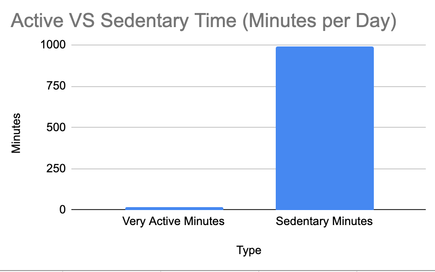
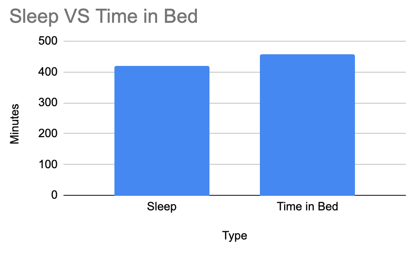

# Bellabeat Case Study

## Overview
This project is part of the Google Data Analytics Certificate. The goal of this case study is to analyze smart device usage data and provide insights to support Bellabeat’s marketing strategy.

## Business Problem
Bellabeat aims to grow in the smart device market. This analysis explores how users interact with fitness devices and identifies opportunities to improve engagement and marketing effectiveness.

## Key Insights
- Users average ~7,281 steps per day, below the recommended 10,000 steps
- High sedentary behavior (~16 hours per day)
- Users are only highly active for ~20 minutes per day
- Sleep duration is around 7 hours, but with inefficiencies between time in bed and actual sleep

## Visualizations

### Active vs Sedentary Time

### Sleep vs Time in Bed

## Tools Used
- Google Sheets
- Data Cleaning
- Data Analysis
- Data Visualization

## Files
- `bellabeat-case-study.pdf`: Full case study
- `data/`: Raw datasets used
- `images/`: Visualizations

## Author
Mustafa Guney
